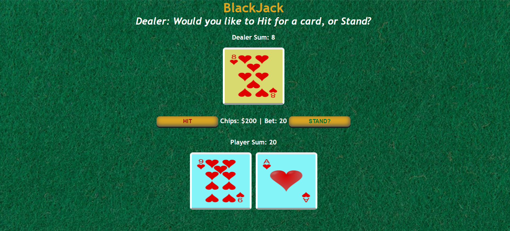

# BlackJack
A simple webpage made for a user to practice skills for a heads up blackjack match against a dealer. 

## Technologies
 
 * **HTML5**
 * **CSS3**
 * **JavaScript**

## Developer Notes
This project allowed me to practice and hone my skills creating an HTML page with CSS styling. In Javascript I implemented data and control structures, altered HTML elements, and used a modulus algorithm to reduce the math footprint.

### How to play

Clone this repository to your machine and run blackJack.html in your favorite browser to begin. Once you select a wager amount, you will be dealt two cards, and can choose to either hit, or stand. 

If you're interested in the rules of blackjack, read about that here. https://bicyclecards.com/how-to-play/blackjack/

Note on play: This blackjack game is a simplified version of the typical casino game. Splitting, doubling down, and insurance betting is not included. 